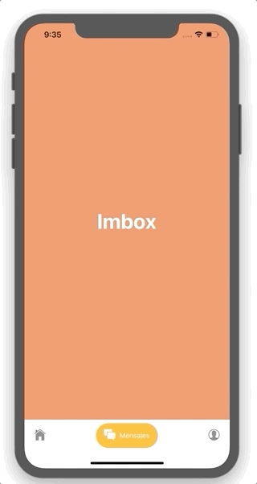

# App CustomTabs

---

Personalización de TabNavigator desarrollado con Expo, React Native y React Navigation

[Demo](https://exp.host/@henrymvc/customTabs)

## ¿Cómo funciona?

Require Expo 3

- `yarn install || npm install` para instalar las depencias.
- `expo start` para el entorno de desarrollo.
- Expo-client para poder probar en un emulador o en un telefono.

## Licencia

MIT
